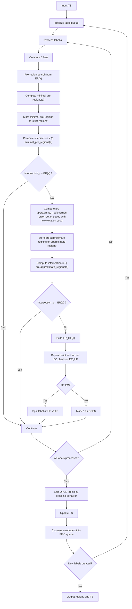

```mermaid
flowchart TD
    A["Input TS"] --> B["Initialize label queue"]
    B --> C["Process label a"]

    C --> D["Compute ER(a)"]
    D --> E["Pre-region search from ER(a)"]

    E --> E1["Compute minimal pre-regions(a)"]
    E1 --> E2["Store minimal pre-regions to 'strict regions'"]
    E2 --> E3["Compute intersection = ⋂ minimal_pre_regions(a)"]
    
    E3 --> F{"intersection_r = ER(a) ?"}
    F -->|Yes| P["Continue"]
    F -->|No| H["Compute pre-approximate_regions(non-region set of states with low violation cost)"]
    H --> H1["Store pre-approximate regions to 'approximate regions'"]

    H1 --> H2["Compute intersection = ⋂ pre-approximate_regions(a)"]

    H2 --> I{"intersection_a = ER(a) ?"}
    I -->|Yes| P
    I -->|No| K["Build ER_HF(a)"]

    K --> L["Repeat strict and loosed EC check on ER_HF"]
    L --> M{"HF EC?"}

    M -->|Yes| N["Split label a: HF vs LF"]
    M -->|No| O["Mark a as OPEN"]

    N --> P
    O --> P

    P --> Q{"All labels processed?"}
    Q -->|No| C
    Q -->|Yes| R["Split OPEN labels by crossing behavior"]

    R --> R1["Update TS"]
    R1 --> R2["Enqueue new labels into FIFO queue"]

    R2 --> S{"New labels created?"}
    S -->|Yes| B
    S -->|No| T["Output regions and TS"]
```