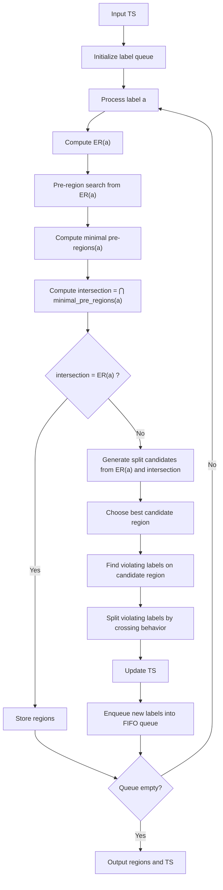

```mermaid
flowchart TD
    A["Input TS"] --> B["Initialize label queue"]
    B --> C["Process label a"]

    C --> D["Compute ER(a)"]
    D --> E["Pre-region search from ER(a)"]
    E --> F["Compute minimal pre-regions(a)"]
    F --> G["Compute intersection = ⋂ minimal_pre_regions(a)"]

    G --> H{"intersection = ER(a) ?"}
    H -->|Yes| I["Store regions"]
    H -->|No| J["Generate split candidates from ER(a) and intersection"]

    J --> K["Choose best candidate region"]
    K --> M["Find violating labels on candidate region"]

    M --> N["Split violating labels by crossing behavior"]
    N --> P["Update TS"]
    P --> Q["Enqueue new labels into FIFO queue"]

    I --> R{"Queue empty?"}
    Q --> R
    R -->|No| C
    R -->|Yes| S["Output regions and TS"]
```